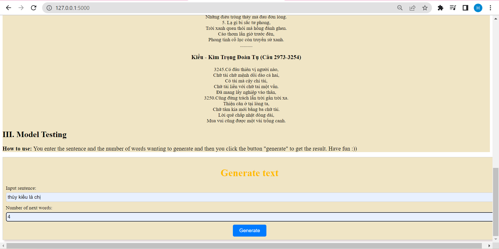

# NLP
## Introduction
Here is my python source code for nature language processing.This reporsitory includes some small projects and each project takes me about 2 weeks or more.

#### Text classification
This project is classification of user's comment about the movies, which is positive or negative.

#### Text Generation
I crawled kieu story on the online website for this project and then I deployed this project on the website.

  
  
  

#### POS - Tagging
The input of this project is english setence and the output is the composition of the words what role in the sentence.

#### Machine Translation
I used mt_eng_vietnamese dataset and iwslt2015-en-vi dataset for this project. The input is the vietnamese sentences and the ouput is the english sentence.
